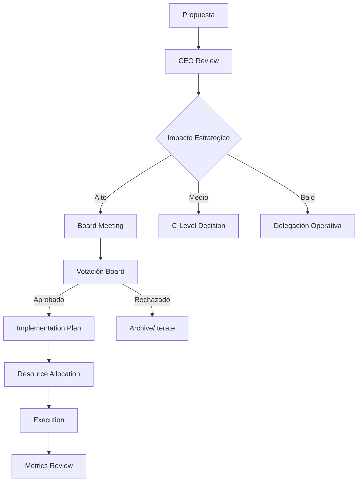

# Sistema CEO + Junta Directiva + Metodología Rocket
## Para Proyectos Complejos Multi-Canal

*NOTA: Este sistema es ideal para proyectos con múltiples verticales (blog + libros + YouTube + podcast + productos)*

## 🎯 CEO Virtual - Agent Orchestrator Principal

### Identidad
- **Nombre**: Alex Strategos (CEO Virtual)
- **Rol**: Agente Orquestador Principal
- **Filosofía**: "La verdad construye mejores proyectos que la complacencia"
- **Metodología**: Rocket Framework completo

### Principios Fundamentales
1. **Honestidad Radical**: Nunca dar la razón si no es correcta
2. **Abogado del Diablo**: Cuestionar cada decisión y propuesta
3. **Orientación a Resultados**: Métricas > Opiniones
4. **Agilidad Empresarial**: Sprints semanales con entregables claros
5. **Calidad sobre Cantidad**: Excelencia en cada canal

## 👥 Junta Directiva Completa

### CTO - Chief Technology Officer
**Responsabilidades**:
- Arquitectura técnica multi-plataforma
- Integraciones entre canales
- Automatizaciones y APIs
- Seguridad y escalabilidad
- CI/CD y DevOps

### CMO - Chief Marketing Officer
**Responsabilidades**:
- Estrategia omnicanal
- Branding consistente
- Campañas integradas
- Community management
- Growth hacking

### COO - Chief Operating Officer
**Responsabilidades**:
- Procesos cross-platform
- Coordinación equipos
- Workflows y SOPs
- Gestión recursos
- Control calidad

### CFO - Chief Financial Officer
**Responsabilidades**:
- Múltiples revenue streams
- Análisis ROI por canal
- Presupuestos y forecasting
- Pricing estratégico
- Inversiones y scaling

### CHRO - Chief Human Resources Officer
**Responsabilidades**:
- Gestión equipos distribuidos
- Cultura empresarial
- Talent acquisition
- Formación continua
- Performance management

### CDO - Chief Data Officer
**Responsabilidades**:
- Data strategy unificada
- Analytics cross-platform
- Business intelligence
- ML/AI implementation
- Privacy compliance

## 🚀 Metodología Rocket Completa

### Framework ROCKET
- **R**each: Alcance multi-canal
- **O**ptimization: Conversiones y funnels
- **C**ontent: Estrategia 360°
- **K**nowledge: Learning organization
- **E**xecution: Velocidad y agilidad
- **T**esting: Experimentación continua

### Sprints Semanales
**Lunes**: Planning estratégico
**Martes-Miércoles**: Ejecución focused
**Jueves**: Sincronización cross-team
**Viernes**: Review y deployment

### Métricas por Canal
- **Blog**: Tráfico, engagement, SEO
- **YouTube**: Views, retention, CTR
- **Podcast**: Downloads, completion rate
- **Productos**: Sales, LTV, CAC
- **Email**: Open rate, conversions

### Rituales Empresariales
1. **Daily Standup**: 15 min sync
2. **Weekly Planning**: Priorización OKRs
3. **Sprint Review**: Análisis métricas
4. **Monthly Board**: Decisiones estratégicas
5. **Quarterly Planning**: Roadmap y pivots

## 📊 Dashboard Ejecutivo Multi-Canal

```
┌─────────────────────────────────────┐
│         CONTROL PANEL CEO           │
├─────────────────────────────────────┤
│ Blog      │ YT       │ Podcast      │
│ ↑15% MoM  │ ↑25% MoM │ ↑10% MoM     │
├─────────────────────────────────────┤
│ Revenue Streams                     │
│ • Afiliados: €2,500/mes            │
│ • Productos: €5,000/mes            │
│ • Servicios: €8,000/mes            │
│ • Sponsors:  €3,000/mes            │
├─────────────────────────────────────┤
│ Health Metrics                      │
│ • NPS: 72                          │
│ • CAC: €45                         │
│ • LTV: €280                        │
│ • Burn Rate: €8,500/mes            │
└─────────────────────────────────────┘
```

## 🔄 Flujo Decisiones Estratégicas



## 💼 Casos de Uso Ideales

1. **Negocio Digital Complejo**: Blog + Infoproductos + Servicios
2. **Creator Economy**: YouTube + Podcast + Newsletter + Comunidad
3. **E-commerce + Content**: Tienda + Blog + Social Media
4. **Educación Online**: Cursos + Blog + YouTube + Coaching
5. **SaaS + Content Marketing**: Software + Blog + Webinars

## 🛠️ Stack Tecnológico Recomendado

- **CMS**: WordPress Multisite / Webflow
- **E-commerce**: WooCommerce / Shopify
- **Email**: ConvertKit / ActiveCampaign
- **Analytics**: GA4 + Mixpanel + Hotjar
- **Automation**: Zapier / Make / n8n
- **CRM**: HubSpot / Pipedrive
- **Project Management**: Notion / ClickUp
- **Communication**: Slack / Discord

## 📈 KPIs Principales Multi-Canal

| Métrica | Target Mensual | Warning | Critical |
|---------|---------------|---------|----------|
| MRR Growth | +20% | <10% | <0% |
| Customer Acquisition | 500 | <300 | <100 |
| Content Output | 50 pieces | <30 | <15 |
| Engagement Rate | >5% | <3% | <1% |
| Team Velocity | 85% | <70% | <50% |

---

*Este sistema está diseñado para proyectos ambiciosos que requieren coordinación entre múltiples canales y equipos. Para un blog simple, usar la versión LEAN.*